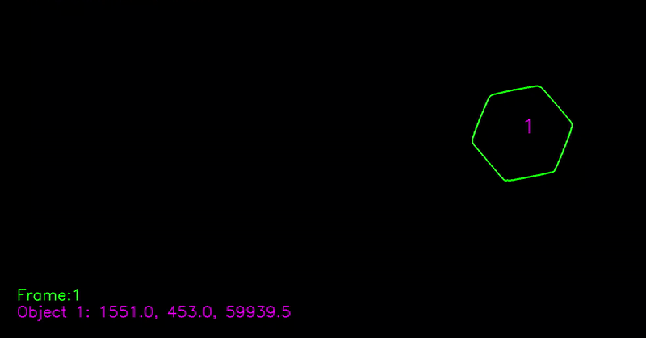

# Detecting and Tracking of Moving Objects on a Convey Belt

Using computer vision techniques, I have implemented an object detecting and tracking algorithm which is able to count moving nuts on a convey belt.

#### Dependencies

* `python 3.8`
* `opencv`
* `numpy`
* `matplotlib`

#### Convey Belt Video Stream

Here the moving nuts on the convey belt is presented. 

#### Detecting and Tracking Video Stream

Presented algorithm is able to detect each nut on the convey belt, and display its' number and coordinates.

